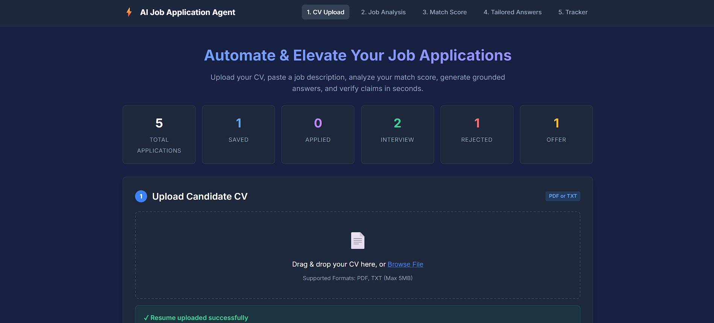
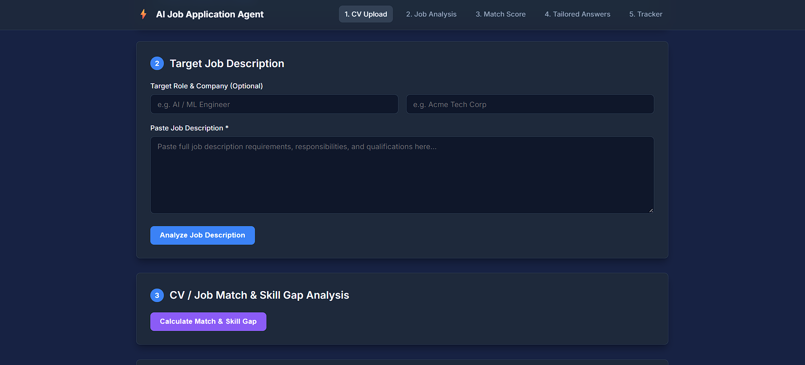
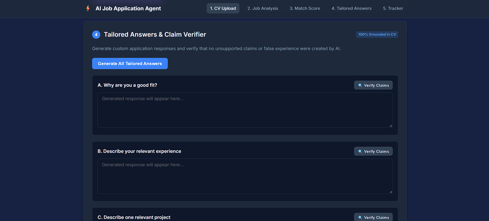
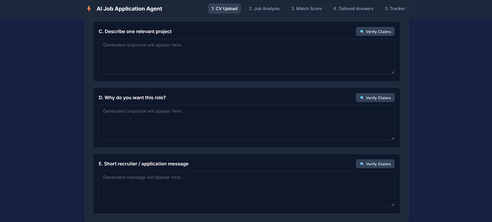
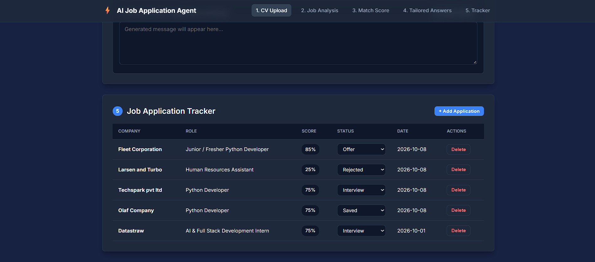

# ⚡ AI Job Application Agent

An AI-powered job application assistant that analyzes a candidate's CV against a target job description, identifies skill gaps, generates tailored application responses, and verifies generated content against the candidate's actual experience.

Built with **Python, FastAPI, SQLAlchemy, SQLite, OpenAI API, and Vanilla JavaScript**.

---

## 📸 Project Preview

### Dashboard



### Job Match & Skill Gap Analysis



### AI-Generated Application Answers




### Application Tracker



---

## 🚀 Features

### 📄 Resume Extraction

* Upload PDF or TXT resumes.
* Extract resume content automatically.
* Use the extracted CV as the source of truth for AI analysis.

### 🎯 Job Requirement Analysis

Extract key information from job descriptions:

* Job role
* Required skills
* Preferred skills
* Responsibilities
* Experience requirements
* Education requirements

### 📊 Match & Skill Gap Analysis

Generate an AI-based match analysis with:

* Overall match score
* **Strong Match** — skills clearly supported by the CV
* **Partial Match** — related experience
* **Missing Skills** — required skills not found in the CV
* Relevant candidate experience

### ✍️ Grounded Application Answers

Generate tailored responses for common application questions:

* Why are you a good fit?
* Describe your relevant experience.
* Describe a relevant project.
* Why do you want this role?
* Short recruiter/application message

Responses are generated using the candidate's actual CV information to reduce unsupported claims.

### 🕵️ Claim Verification

Generated responses are checked against the original CV to identify:

* Unsupported experience
* Invented technologies
* Fake achievements
* Unsupported metrics
* Exaggerated responsibilities

This adds a verification layer between AI generation and the final application response.

### 📌 Application Tracker

Track job applications with:

`Saved` · `Applied` · `Interview` · `Rejected` · `Offer`

The dashboard provides a quick overview of application status and recent applications.

---

## 🏗️ Architecture

```text
                ┌──────────────────────┐
                │      Frontend        │
                │ HTML / CSS / JS      │
                └──────────┬───────────┘
                           │
                       REST APIs
                           │
                           ▼
                ┌──────────────────────┐
                │     FastAPI          │
                │      Backend         │
                └──────────┬───────────┘
                           │
              ┌────────────┼────────────┐
              ▼            ▼            ▼
          Resume         Job &        Application
          Service       Matching        Tracker
              │            │
              └──────┬─────┘
                     ▼
              ┌───────────────┐
              │   AI Service  │
              │  OpenAI API   │
              └───────┬───────┘
                      │
              ┌───────▼────────┐
              │ SQLite /        │
              │ SQLAlchemy      │
              └────────────────┘
```

---

## 🛠️ Tech Stack

| Technology             | Purpose                                   |
| ---------------------- | ----------------------------------------- |
| **Python**             | Backend development                       |
| **FastAPI**            | REST API layer                            |
| **Pydantic**           | Data validation & structured AI responses |
| **SQLAlchemy**         | Database ORM                              |
| **SQLite**             | Application database                      |
| **OpenAI API**         | AI analysis & generation                  |
| **PyMuPDF**            | PDF text extraction                       |
| **HTML5 / CSS3**       | Frontend                                  |
| **Vanilla JavaScript** | Frontend interaction                      |

---

## 🔄 How It Works

```text
CV Upload
    ↓
Resume Text Extraction
    ↓
Job Description Analysis
    ↓
Requirement Extraction
    ↓
CV ↔ Job Matching
    ↓
Match Score + Skill Gaps
    ↓
Tailored Application Answers
    ↓
Claim Verification
    ↓
Save Application
```

---

## 📂 Project Structure

```text
ai-job-application-agent/
│
├── app/
│   ├── main.py
│   ├── database.py
│   ├── models.py
│   ├── schemas.py
│   │
│   ├── routes/
│   │   ├── documents.py
│   │   ├── analysis.py
│   │   └── applications.py
│   │
│   ├── services/
│   │   ├── llm_service.py
│   │   ├── resume_service.py
│   │   ├── job_service.py
│   │   ├── matching_service.py
│   │   └── verification_service.py
│   │
│   └── utils/
│
├── frontend/
│   ├── index.html
│   ├── style.css
│   └── app.js
│
├── evaluation/
├── assets/
├── uploads/
├── requirements.txt
├── .env.example
├── .gitignore
└── README.md
```

---

## ⚙️ Local Setup

### 1. Clone the repository

```bash
git clone https://github.com/YOUR_USERNAME/ai-job-application-agent.git
cd ai-job-application-agent
```

### 2. Create a virtual environment

```bash
python -m venv .venv
.venv\Scripts\activate
```

### 3. Install dependencies

```bash
pip install -r requirements.txt
```

### 4. Configure environment variables

Create a `.env` file:

```env
OPENAI_API_KEY=your_api_key_here
OPENAI_MODEL=gpt-4o-mini
```

### 5. Run the application

```bash
uvicorn app.main:app --reload
```

Open:

```text
http://127.0.0.1:8000
```

API documentation:

```text
http://127.0.0.1:8000/docs
```

---

## 💡 What This Project Demonstrates

* AI-powered document processing
* Structured LLM outputs
* CV-to-job semantic matching
* Skill-gap analysis
* Grounded text generation
* AI hallucination / claim verification
* REST API development
* Database integration
* Frontend-backend integration
* Practical AI workflow design

---

## 👩‍💻 Author

**Khushi Das**

AI/ML & Backend Developer
**Python · FastAPI · AI · RAG · REST APIs · SQL**
